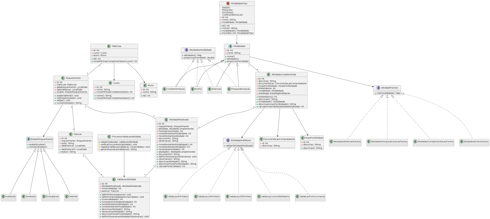
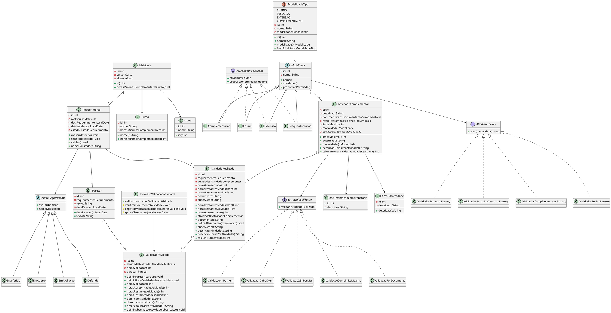

# Sistema de Validação de Atividades Complementares - IFSC Tubarão

## 📌 Apresentação do Projeto

Este projeto acadêmico é desenvolvido para a disciplina de **Projeto de Sistemas** do curso de **Análise e Desenvolvimento de Sistemas (ADS)** do IFSC Tubarão.

O sistema gerencia a validação de atividades complementares realizadas por alunos, organizando modalidades, tipos de atividades e regras específicas para validar a carga horária mínima exigida pelo curso.

### Funcionalidades principais:
- Listagem e seleção de modalidades e atividades
- Validação de atividades conforme regras específicas (limites de horas, documentos comprobatórios, entre outras)
- Controle de estado do requerimento (em aberto, deferido, indeferido)
- Geração de parecer detalhado da validação
- Projeto sem persistência de dados (execução em memória)

---

### Grupo
- João Victor Garcia
- Gabriel Gomes
- Caua Gonzaga

---

## 📁 Estrutura do Projeto

```
ifsc.jvgc/
├── controller/
│   └── MenuController.java
├── model/
│   ├── modalidade/
│   │   ├── atividades/
│   │   │   ├── AtividadeFactory.java
│   │   │   ├── AtividadesComplementacaoFactory.java
│   │   │   ├── AtividadesEnsinoFactory.java
│   │   │   ├── AtividadesExtensaoFactory.java
│   │   │   └── AtividadesPesquisaInovacaoFactory.java
│   │   ├── tipos/
│   │   │   ├── AtividadesModalidade.java
│   │   │   ├── Complementacao.java
│   │   │   ├── Ensino.java
│   │   │   ├── Extensao.java
│   │   │   ├── Modalidade.java
│   │   │   └── PesquisaInovacao.java
│   │   └──  ModalidadeTipo.java
│   ├── requerimento/
│   │   ├── estados/
│   │   │   ├── Deferido.java
│   │   │   ├── EmAberto.java
│   │   │   ├── EmAvaliacao.java
│   │   │   ├── EstadoRequerimento.java
│   │   │   └── Indeferido.java
│   │   └── Requerimento.java
│   ├── validacao/
│   │   ├── EstrategiaValidacao.java
│   │   ├── Validacao4hPorItem.java
│   │   ├── Validacao10hPorItem.java
│   │   ├── Validacao25hPorMes.java
│   │   ├── ValidacaoComLimiteMaximo.java
│   │   ├── ValidacaoPorDocumento.java
│   ├── Aluno.java
│   ├── AtividadeComplementar.java
│   ├── AtividadeRealizada.java
│   ├── Curso.java
│   ├── DocumentacaoComprobatoria.java
│   ├── HorasPorAtividade.java
│   ├── Matricula.java
│   └── Parecer.java
│   ├── ProcessoValidacaoAtividade.java
│   ├── ValidacaoAtividade.java
├── view/
│   └──  MenuInterativo.java
└── Main.java
```

---

## 📊 Diagramas UML

### Diagrama de Classes


## PlantUML
Pode ser visualizado em [plantuml.online](https://plantuml.online/)

<details>
<summary>Código PlantUML</summary>


</details>

---

## ⚙️ Princípios e Padrões de Projeto Utilizados

### 🔄 **Strategy Pattern**
- **Localização**: Pacote `validacao` (EstrategiaValidacao, Validacao4hPorItem, etc.)
- **Objetivo**: Permite diferentes estratégias de validação para atividades complementares
- **Benefício**: Facilita a adição de novas regras de validação sem modificar código existente

### 🏭 **Factory Method**
- **Localização**: Classes `AtividadeFactory` e a suas especializações
- **Objetivo**: Criação encapsulada de diferentes tipos de modalidades e atividades
- **Benefício**: Facilita a expansão para novas modalidades sem alterar código cliente

### 🔀 **State Pattern**
- **Localização**: Pacote `requerimento.estados` (EstadoRequerimento e subclasses)
- **Objetivo**: Controla o comportamento do requerimento baseado no seu estado atual
- **Benefício**: Cada estado tem comportamento específico, tornando o código mais limpo e extensível

### 📏 **Lei de Deméter (Law of Demeter)**
- **Aplicação**: Métodos diretos para acessar informações, evitando cadeias longas de chamadas
- **Exemplo**: `matricula.horasMinimasComplementaresCurso()` ao invés de `matricula.curso.horasMinimasComplementares()`

---

## ▶️ Instruções de Uso

### ✅ **Pré-requisitos**
- Java 17 ou superior
- IDE como IntelliJ IDEA, Eclipse ou VSCode (com extensões Java)
- Sistema operacional: Windows, Linux ou macOS

### 📦 **Compilação**
Compile todas as classes dentro da estrutura do projeto:

```bash
# Navegue até a pasta raiz do projeto
cd caminho/para/projeto

# Compile todas as classes Java
javac -d bin $(find src -name "*.java")
```

### 🚀 **Execução**
Execute a classe principal do sistema:

```bash
# Execute a aplicação
java -cp bin ifsc.jvgc.Main
```

### 📋 **Fluxo de Uso**

1. **Inicialização**: Execute a classe `Main.java`
2. **Menu Interativo**: Utilize o `MenuInterativo` para navegar pelas opções
3. **Seleção de Modalidade**: Escolha entre Ensino, Extensão, Pesquisa/Inovação ou Complementação
4. **Seleção de Atividade**: Selecione a atividade específica dentro da modalidade
5. **Validação**: Use `MenuController.validarAtividade()` para processar as horas
6. **Parecer**: Gere o parecer final com `MenuController.gerarParecer()`

---

## 🎓 **Contexto Acadêmico**

### **Disciplina**: Projeto de Sistemas
### **Curso**: Análise e Desenvolvimento de Sistemas (ADS)
### **Instituição**: Instituto Federal de Santa Catarina (IFSC) - Campus Tubarão

---

## 📝 **Características**:
- Projeto sem persistência de dados (execução em memória)
- Foco na aplicação de padrões de projeto
- Validação de conceitos de orientação a objetos

---

## 🤝 **Contribuições**

Este é um projeto acadêmico desenvolvido como parte do currículo do curso de ADS. Sugestões e melhorias são bem-vindas para fins educacionais.

